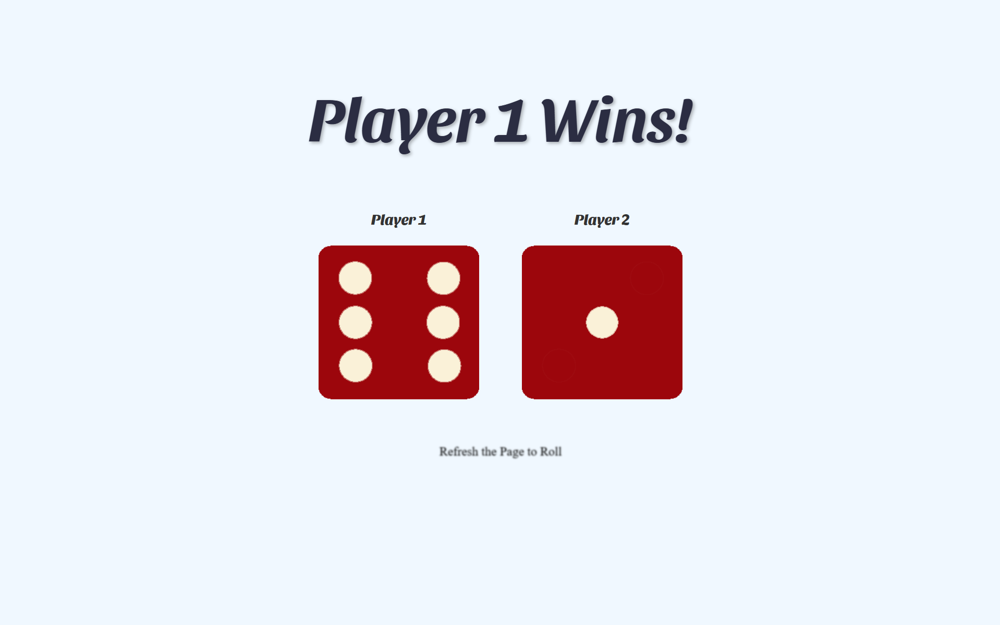

# 🎲 Roll The Dice 🎲

A fun and simple **2-player dice game** built with HTML, CSS, and JavaScript.  
Refresh the page to roll the dice and see which player wins!

🌐 **Live Demo**: [Play Roll The Dice](https://catheringino.github.io/Roll-The-Dice/)

---

## 📸 Preview


---

## ✨ Features
- 🎲 **Random dice rolls** every refresh
- 🏆 Declares **Player 1** or **Player 2** as the winner (or a draw)
- 🎨 Clean and minimal UI
- ⚡ Instant results—no clicks needed

---

## 🛠️ Technologies Used
- **HTML5** – Structure of the game
- **CSS3** – Styling and layout
- **JavaScript (Vanilla)** – Dice rolling logic and DOM manipulation

---

## 🚀 How to Play
1. Open the [Roll The Dice Game](https://catheringino.github.io/Roll-The-Dice/).
2. **Refresh the page** to roll the dice.
3. See who wins based on the random rolls.

---

## 📂 Installation & Setup
If you want to run this project locally:
```bash
# Clone the repository
git clone https://github.com/CatherinGino/Roll-The-Dice.git

# Open the folder
cd Roll-The-Dice

# Open index.html in your browser
